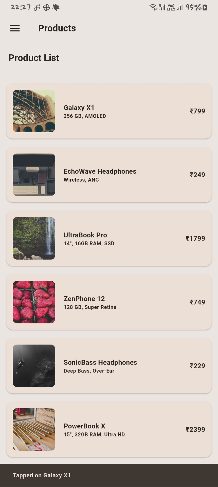
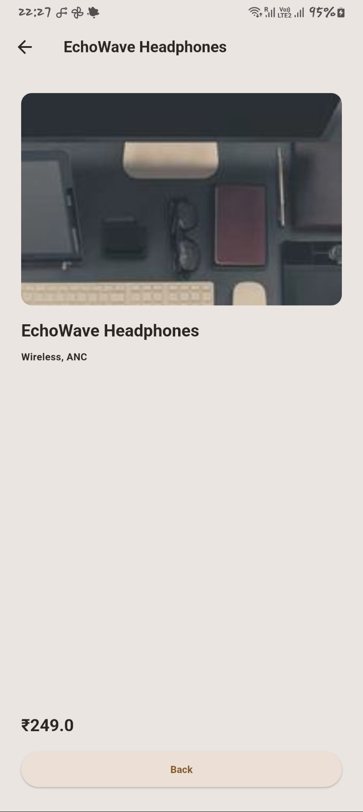
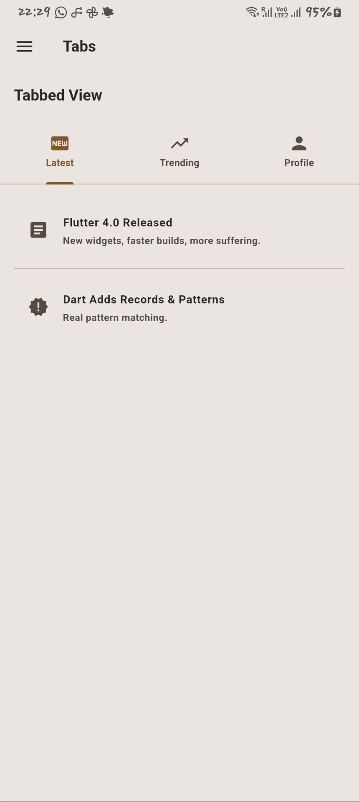

# Widgets Demo – Flutter

This Flutter project demonstrates the use of intermediate-level widgets like `ListView.builder`, `Card`, `TabBar`, and conditional navigation.

## Features

-**Product List View**  
  Scrollable list of product cards with image, title, subtitle, and price.
    - Tapping on **only the second product** navigates to a detail page.
    - Other items show a SnackBar.

- **Tab Navigation**  
  Tab-based layout with three tabs: `Latest News`, `Trending`, and `Profile`.

- **Drawer Navigation**  
  Switch between Product List and Tabs using `Drawer`.

# Project Images

  
  
  

